<div align="center">

# Road Surface Segmentation

### Segmentação inteligente de danos em vias com YOLO26

Pipeline completo para **detectar e segmentar buracos (potholes)** em imagens e vídeos POV/dashcam — do pré-processamento de vídeo à inferência com máscaras de instância.

<br>

[](https://www.python.org/)
[](https://docs.ultralytics.com/)
[](https://opencv.org/)
[](https://onnx.ai/)
[](https://creativecommons.org/licenses/by/4.0/)

<br>

[**Visão Geral**](#visão-geral) ·
[**Modelo**](#modelo) ·
[**Dataset**](#dataset) ·
[**Pré-processamento**](#pré-processamento-de-vídeos) ·
[**Métricas**](#métricas-de-treinamento) ·
[**Quick Start**](#quick-start) ·
[**Estrutura**](#estrutura-do-projeto)

</div>

---

## Visão Geral

Este repositório reúne um fluxo de ponta a ponta para inspeção automatizada de pavimento:

| Etapa | Ferramenta | Saída |
|-------|------------|-------|
| **1. Coleta** | Vídeos POV/dashcam | `videos/` |
| **2. Pré-processamento** | `prepare_road_videos.py` | Frames anotáveis + vídeos desacelerados |
| **3. Treinamento** | Notebook Ultralytics | `models/best.pt` |
| **4. Deploy** | ONNX FP16/FP32 | Inferência em produção |

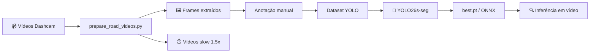

O objetivo é produzir **máscaras de segmentação** de buracos em estrada, úteis para overlays visuais, estimativa de severidade e workflows de inspeção em vídeo.

---

## Modelo

### YOLO26s — Instance Segmentation

Modelo fine-tuned a partir de `yolo26s-seg.pt` (Ultralytics), treinado em 3 estágios:

1. **Baseline** — `imgsz=640`, 100 épocas, validação do pipeline
2. **Fine-tune conservador** — learning rate baixo, augmentação reduzida
3. **Alta resolução** — `imgsz=768`, `lr0=0.001`, melhor qualidade de máscara

### Resultados finais (época 28 — melhor checkpoint)

Métricas de validação no conjunto **292 imagens / 560 instâncias**:

| Métrica | Box (B) | Mask (M) |
|---------|---------|----------|
| **Precision** | 76.5% | **78.1%** |
| **Recall** | 67.1% | **68.1%** |
| **mAP@50** | 75.9% | **76.4%** |
| **mAP@50-95** | 47.7% | **48.1%** |

> Early stopping na época 53 (patience=25). Melhor resultado observado na **época 28**.

### Artefatos disponíveis

| Arquivo | Formato | Uso |
|---------|---------|-----|
| `models/best.pt` | PyTorch | Treino, fine-tune, inferência Ultralytics |
| `models/yolo26s_pothole_segmentation_fp32.onnx` | ONNX FP32 | Máxima precisão |
| `models/yolo26s_pothole_segmentation_fp16_compact.onnx` | ONNX FP16 | Deploy otimizado |
| `models/args.yaml` | Config | Hiperparâmetros do último treino |

### Inferência

| Ambiente | Latência |
|----------|----------|
| Tesla T4 (Colab) | ~7.9 ms/imagem |
| Pré-processamento | ~0.3 ms |
| Pós-processamento | ~3.5 ms |

```python
from ultralytics import YOLO

model = YOLO("models/best.pt")
results = model.predict("frame.jpg", imgsz=768, conf=0.25)
results[0].show()
```

---

## Dataset

### Dataset de treinamento (Roboflow)

Fonte: [Pothole Segmentation — Roboflow Universe](https://universe.roboflow.com/emotion-recognition-mcwg0/pothole-segmentation-g6hbh-193vt) · Licença **CC BY 4.0**

O dataset original continha classes duplicadas (`Pothole`, `Potholes`, `pothole`, `Manhole`, `Unmarked Bump`). Para o baseline, as variações foram **unificadas em uma única classe `pothole`**, mantendo o treino limpo e consistente.

| Split | Imagens | Instâncias |
|-------|---------|------------|
| **Train** | 893 | 2.106 |
| **Valid** | 292 | 560 |
| **Test** | 348 | — |

<p align="center">
  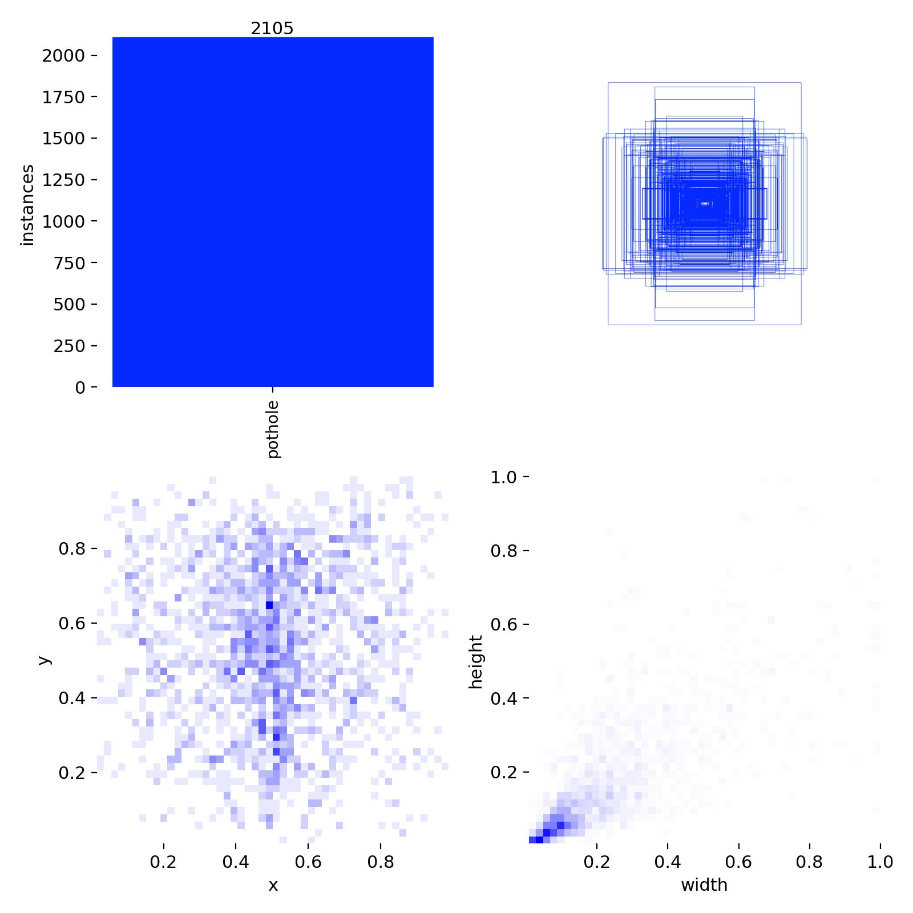
  <br>
  <em>Distribuição espacial e dimensional dos labels de segmentação</em>
</p>

### Dados próprios — vídeos dashcam

Vídeos POV gravados em movimento, processados localmente pelo script de pré-processamento. **Não são versionados** (ver `.gitignore`).

| Pasta | Conteúdo | Versionado |
|-------|----------|------------|
| `videos/` | Vídeos brutos `.mp4` | Não |
| `processed_videos/` | Versões desaceleradas 1.5× | Não |
| `frames/` | Frames extraídos para anotação | Não |
| `reports/` | Metadados JSON por vídeo | Não |

---

## Pré-processamento de vídeos

O script [`prepare_road_videos.py`](prepare_road_videos.py) transforma vídeos dashcam em material pronto para anotação YOLO.

### Funcionalidades

- Desaceleração via **ffmpeg** (`setpts`, H.264, CRF 18)
- Extração densa de frames com **amostragem inteligente**
- Pontuação de qualidade na **ROI da via** (parte inferior ~55%)
- TUI interativa (Textual) + CLI completa
- Relatórios JSON com métricas por frame

### Modos de amostragem (`--sampling-mode`)

| Modo | Descrição |
|------|-----------|
| `random` | Timestamps aleatórios distribuídos |
| `uniform` | Espaçamento uniforme no tempo |
| `smart` | Maior score global entre candidatos |
| `hybrid` | **Padrão** — melhor frame por segmento temporal |

### Extração em escala (milhares de frames)

```bash
source .venv/bin/activate
pip install opencv-python numpy rich textual

# ~3.500+ frames dos 5 vídeos atuais (intervalo de 0.05 s)
python prepare_road_videos.py \
  --frame-interval 0.05 \
  --slow-factor 1.5 \
  --sampling-mode hybrid \
  --overwrite
```

Documentação completa: [`README_preprocessing.md`](README_preprocessing.md)

---

## Métricas de treinamento

### Curvas de aprendizado

<p align="center">
  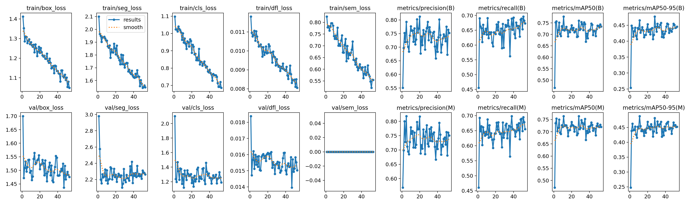
  <br>
  <em>Evolução de loss e métricas ao longo de 53 épocas — convergência estável após ~20 épocas</em>
</p>

### Curvas de performance

<table>
  <tr>
    <td align="center" width="50%">
      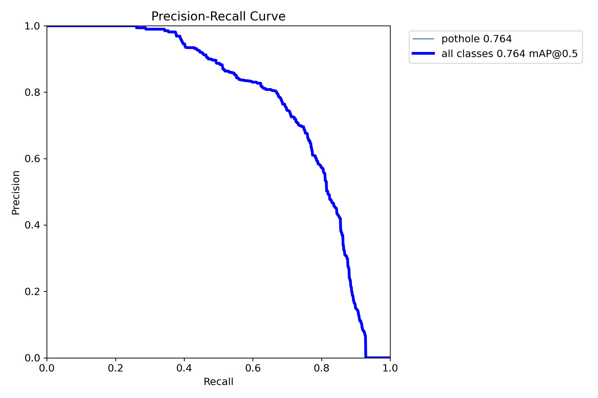<br>
      <sub><b>Mask PR Curve</b></sub>
    </td>
    <td align="center" width="50%">
      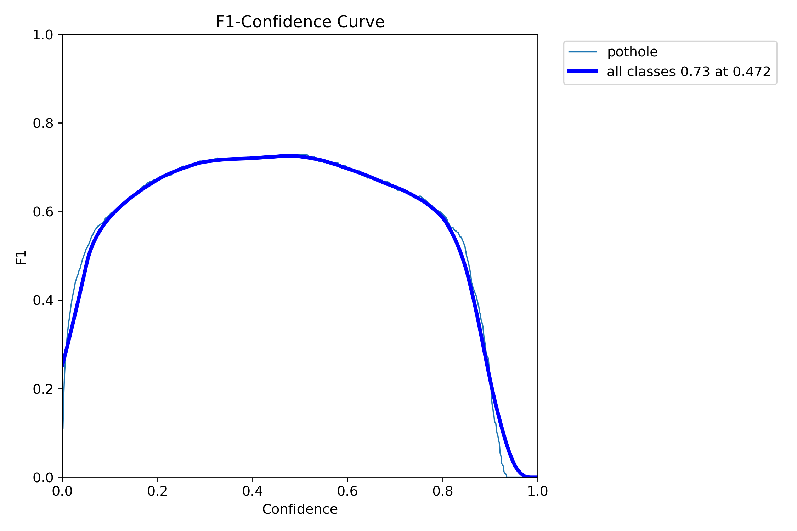<br>
      <sub><b>Mask F1 Curve</b></sub>
    </td>
  </tr>
  <tr>
    <td align="center">
      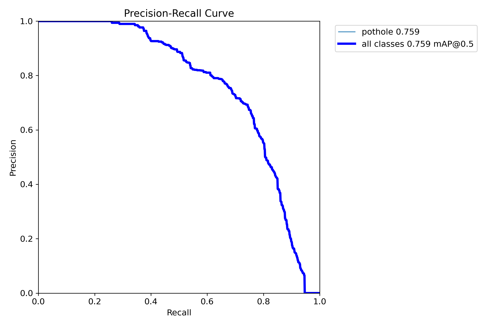<br>
      <sub><b>Box PR Curve</b></sub>
    </td>
    <td align="center">
      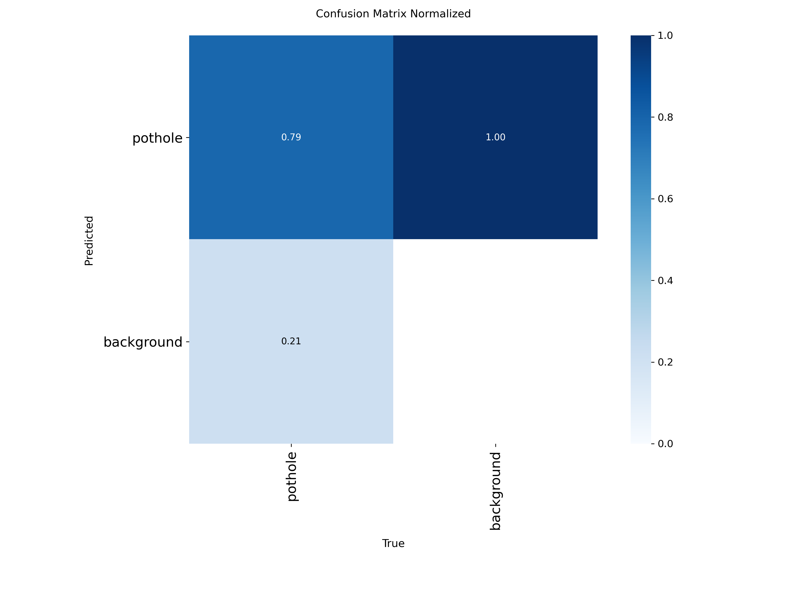<br>
      <sub><b>Confusion Matrix (normalizada)</b></sub>
    </td>
  </tr>
</table>

### Predições em validação

Comparação entre **labels** (ground truth) e **predições** do modelo:

<table>
  <tr>
    <td align="center" width="50%">
      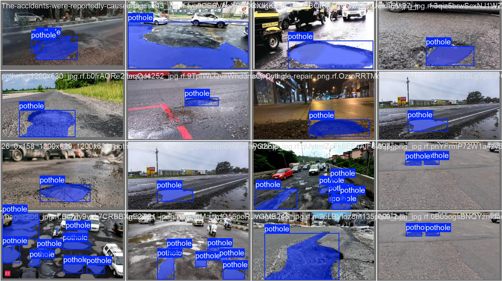<br>
      <sub>Batch 0 — Labels</sub>
    </td>
    <td align="center" width="50%">
      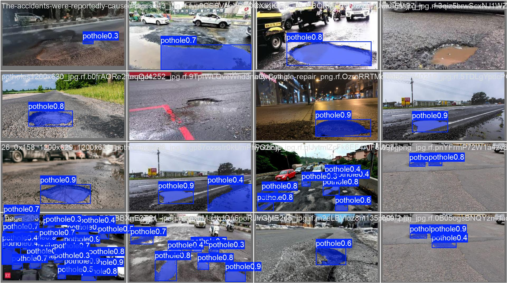<br>
      <sub>Batch 0 — Predições</sub>
    </td>
  </tr>
  <tr>
    <td align="center">
      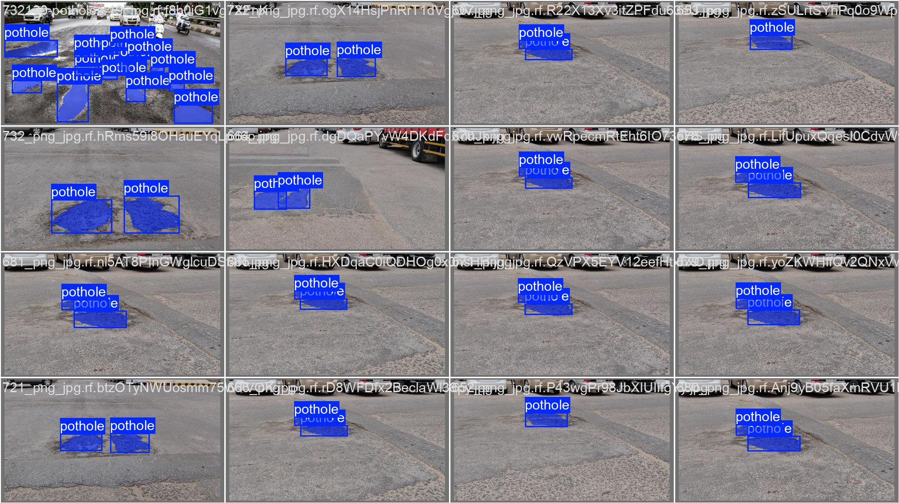<br>
      <sub>Batch 1 — Labels</sub>
    </td>
    <td align="center">
      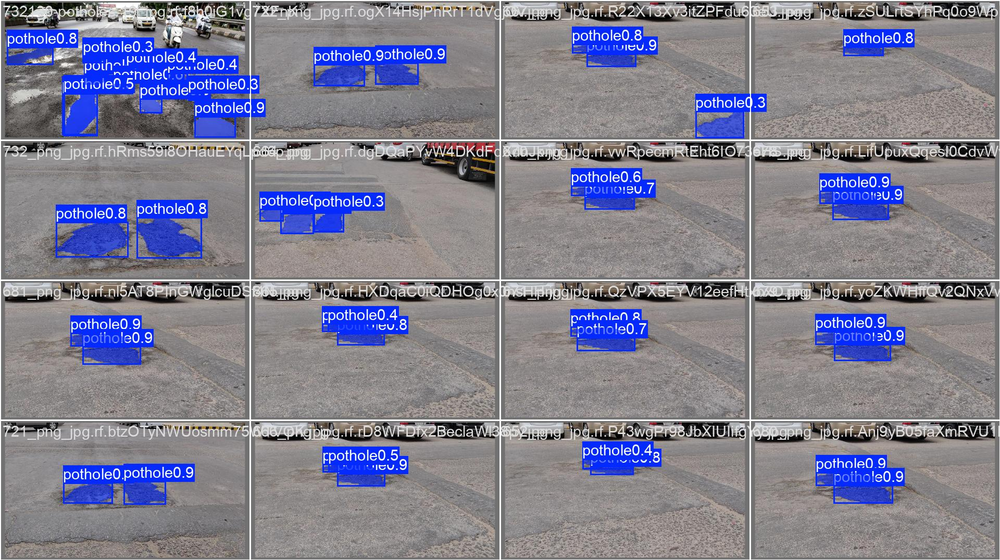<br>
      <sub>Batch 1 — Predições</sub>
    </td>
  </tr>
  <tr>
    <td align="center">
      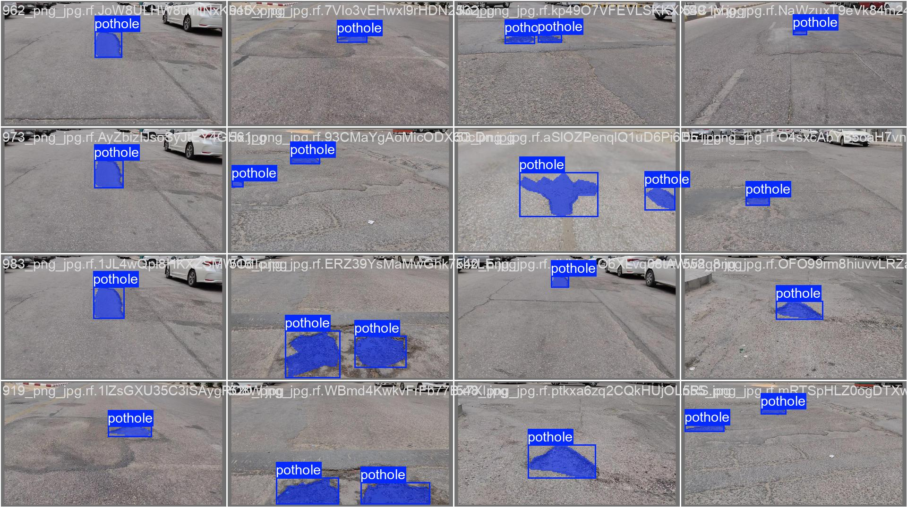<br>
      <sub>Batch 2 — Labels</sub>
    </td>
    <td align="center">
      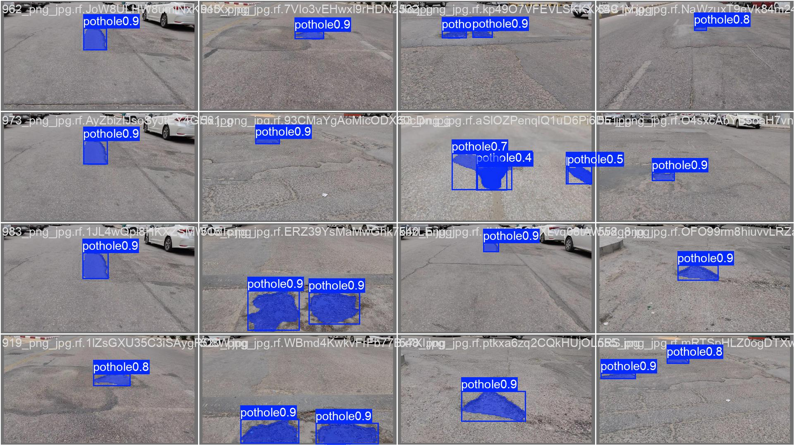<br>
      <sub>Batch 2 — Predições</sub>
    </td>
  </tr>
</table>

### Batches de treinamento (augmentação)

<p align="center">
  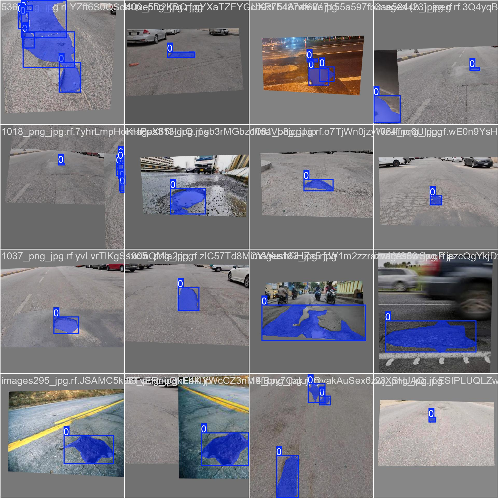
  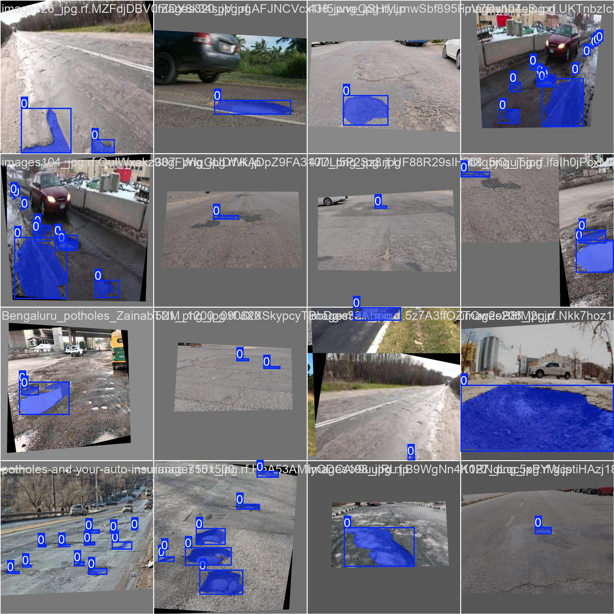
  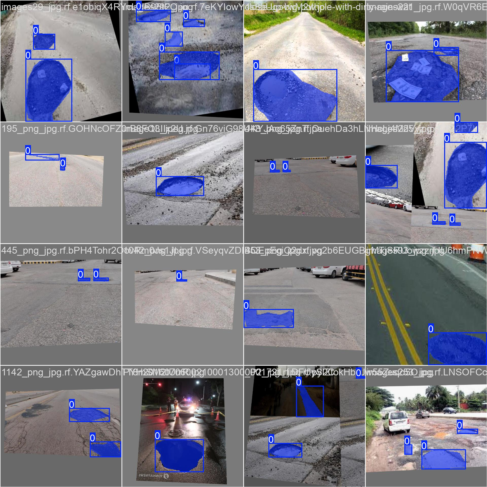
  <br>
  <em>Amostras de batches de treino com augmentação (mosaic, RandAugment, flip)</em>
</p>

---

## Quick Start

### 1. Ambiente

```bash
python -m venv .venv
source .venv/bin/activate
pip install ultralytics opencv-python numpy rich textual
```

> **ffmpeg** também é necessário para o pré-processamento de vídeos.

### 2. Extrair frames dos vídeos

```bash
# Coloque os vídeos em videos/ e execute:
python prepare_road_videos.py --frame-interval 0.05 --slow-factor 1.5
```

### 3. Inferência com o modelo treinado

```bash
yolo segment predict model=models/best.pt source=frames/ imgsz=768 conf=0.25
```

### 4. Retreinar / fine-tune

Abra o notebook de baseline:

```bash
jupyter notebook notebooks/01_train_yolo_pothole_segmentation_baseline.ipynb
```

---

## Estrutura do projeto

```
road-surface-segmentation/
├── 📄 README.md                          # Este documento
├── 📄 README_preprocessing.md              # Guia do script de vídeos
├── 🐍 prepare_road_videos.py               # Pré-processamento + TUI
├── 🐍 test_prepare_videos.py               # Testes do pipeline de vídeo
│
├── 📓 notebooks/
│   └── 01_train_yolo_pothole_segmentation_baseline.ipynb
│
├── 🧠 models/
│   ├── best.pt                             # Checkpoint PyTorch
│   ├── args.yaml                           # Hiperparâmetros
│   ├── yolo26s_pothole_segmentation_fp32.onnx
│   └── yolo26s_pothole_segmentation_fp16_compact.onnx
│
├── 📊 metrics/                             # Gráficos e predições de treino
│   ├── results.png
│   ├── results.csv
│   ├── confusion_matrix_normalized.png
│   ├── MaskPR_curve.png
│   └── val_batch*_pred.jpg
│
├── 🎬 videos/          (gitignored)        # Vídeos dashcam brutos
├── 🖼️ frames/          (gitignored)        # Frames extraídos
├── ⏱️ processed_videos/ (gitignored)        # Vídeos desacelerados
└── 📋 reports/         (gitignored)        # Relatórios JSON
```

---

## Hiperparâmetros do treino final

Extraídos de `models/args.yaml`:

| Parâmetro | Valor |
|-----------|-------|
| Modelo base | `yolo26s-seg` (fine-tuned) |
| Task | `segment` |
| Image size | **768** |
| Epochs | 120 (early stop @ 53) |
| Batch | 20 |
| Optimizer | AdamW |
| Learning rate | 0.001 → 0.02 (cosine) |
| Augmentação | mosaic 0.2, RandAugment, flip 0.5 |
| Device | NVIDIA Tesla T4 |

---

## Roadmap

- [ ] Expandir classes: trincas, remendos, buracos de bueiro
- [ ] Pipeline de inferência em vídeo com tracking temporal
- [ ] Dashboard de inspeção com mapa de severidade
- [ ] Fine-tune com frames próprios das dashcams
- [ ] Quantização INT8 para edge devices

---

<div align="center">

**Road Surface Segmentation** — Computer Vision aplicada à infraestrutura viária

Desenvolvido com YOLO26 · OpenCV · Ultralytics

</div>
